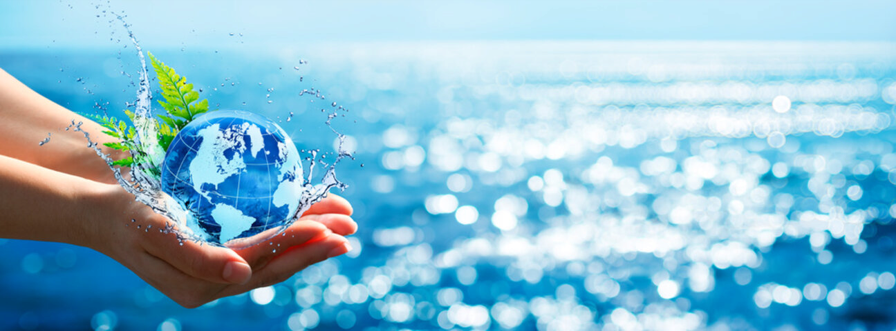

# Problem
An essential element in our life and 70% of our earth is made up of it. Yet we mankind have been polluting it knowingly or unknowingly. Dr. Nikita Kumari was aware of it and wanted to start a new project on it outside of her company's work and more like a collaborative initiative with like minded people. She hid the project name in the image. Flag the project name.

# Image

# Solution
The solution was very creative, the text is hidden in the bitmap plane of the image, which can be seen when we see the bit planes. I used a tool called stegOnline.